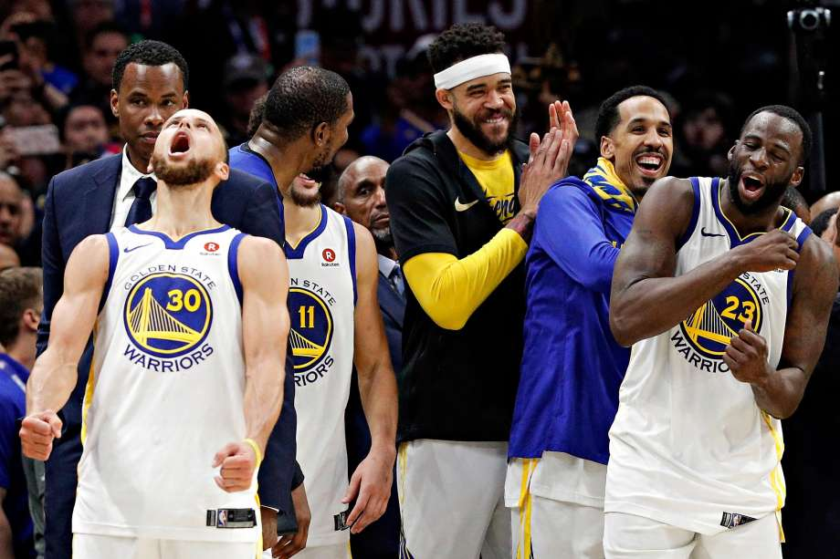
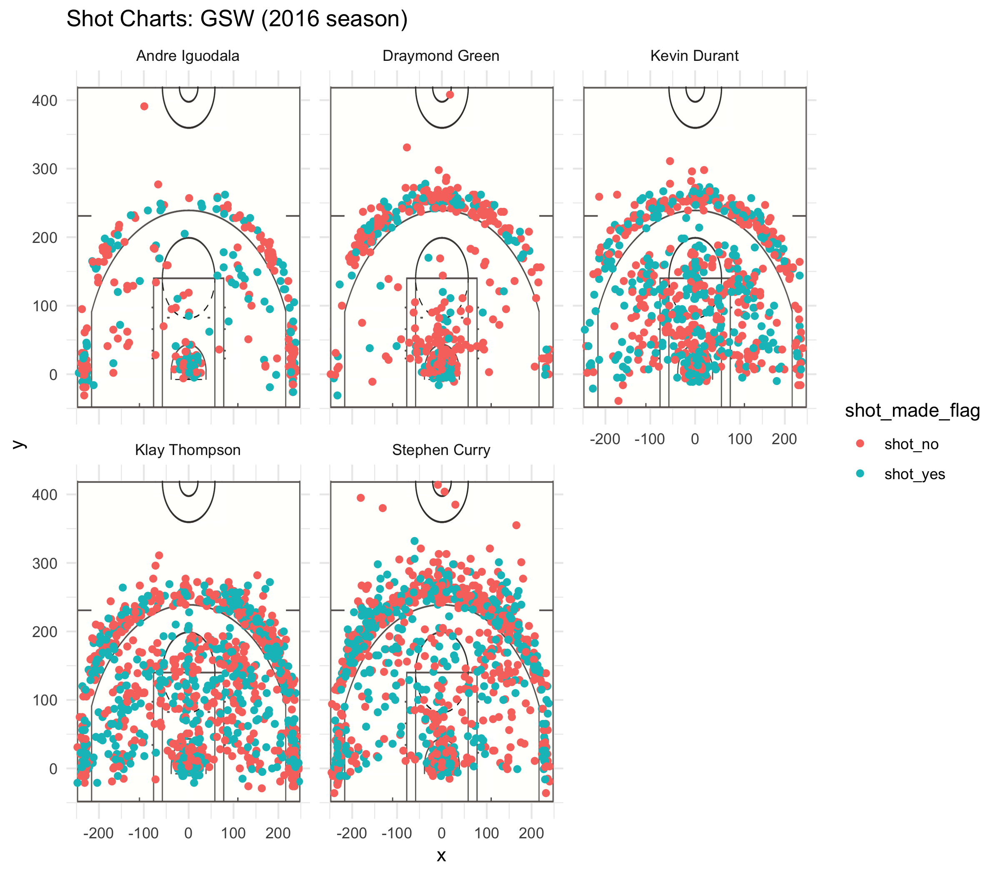

Workout 1
================
Ishira Shrivatsa
3/4/2019

``` r
library(dplyr)
```

    ## 
    ## Attaching package: 'dplyr'

    ## The following objects are masked from 'package:stats':
    ## 
    ##     filter, lag

    ## The following objects are masked from 'package:base':
    ## 
    ##     intersect, setdiff, setequal, union

``` r
library(ggplot2)
```

``` r
## Importing shots-data.csv 

binded_df = read.csv("../data/shots-data.csv", stringsAsFactors = FALSE)
```

``` r
## 2PT Effective Shooting % by player

two_point = filter(binded_df, shot_type == "2PT Field Goal") 
two_point = select(two_point, name, shot_type, shot_made_flag)

two_point$shots_made = two_point$shot_made_flag == "shot_yes"
two_point$total_shots = two_point$shot_type == "2PT Field Goal"

two_point_data = two_point %>%
  group_by(name) %>%
  summarise(total_shots = sum(total_shots), shots_made = sum(shots_made)) %>%
  mutate(percentage_made = (shots_made/total_shots)*100) %>%
  arrange(desc(percentage_made))

two_point_data
```

    ## # A tibble: 5 x 4
    ##   name           total_shots shots_made percentage_made
    ##   <chr>                <int>      <int>           <dbl>
    ## 1 Andre Iguodala         210        134            63.8
    ## 2 Kevin Durant           643        390            60.7
    ## 3 Stephen Curry          563        304            54.0
    ## 4 Klay Thompson          640        329            51.4
    ## 5 Draymond Green         346        171            49.4

``` r
## 3PT Effective Shooting % by player

three_point = filter(binded_df, shot_type == "3PT Field Goal") 
three_point = select(three_point, name, shot_type, shot_made_flag)

three_point$shots_made = three_point$shot_made_flag == "shot_yes"
three_point$total_shots = three_point$shot_type == "3PT Field Goal"

three_point_data = three_point %>%
  group_by(name) %>%
  summarise(total_shots = sum(total_shots), shots_made = sum(shots_made)) %>%
  mutate(percentage_made = (shots_made/total_shots)*100) %>%
  arrange(desc(percentage_made))

three_point_data
```

    ## # A tibble: 5 x 4
    ##   name           total_shots shots_made percentage_made
    ##   <chr>                <int>      <int>           <dbl>
    ## 1 Klay Thompson          580        246            42.4
    ## 2 Stephen Curry          687        280            40.8
    ## 3 Kevin Durant           272        105            38.6
    ## 4 Andre Iguodala         161         58            36.0
    ## 5 Draymond Green         232         74            31.9

``` r
## Effective Shooting % by player

total_points = select(binded_df, name, shot_type, shot_made_flag)
total_points$total_shots = (total_points$shot_type == "2PT Field Goal" | total_points$shot_type == "3PT Field Goal")
total_points$shots_made = (total_points$shot_made_flag == "shot_yes")

total_points_data = total_points %>%
  group_by(name) %>%
  summarise(total_shots = sum(total_shots), shots_made = sum(shots_made)) %>%
  mutate(percentage_made = (shots_made/total_shots)*100) %>%
  arrange(desc(percentage_made))

total_points_data
```

    ## # A tibble: 5 x 4
    ##   name           total_shots shots_made percentage_made
    ##   <chr>                <int>      <int>           <dbl>
    ## 1 Kevin Durant           915        495            54.1
    ## 2 Andre Iguodala         371        192            51.8
    ## 3 Klay Thompson         1220        575            47.1
    ## 4 Stephen Curry         1250        584            46.7
    ## 5 Draymond Green         578        245            42.4

Why does everyone seem to be talking about the Warriors?
========================================================

#### Ishira Shrivatsa

 <https://s.hdnux.com/photos/73/70/10/15696397/7/920x920.png>

Whether or not you are a sports fan, you must have heard about the Golden State Warriors, a.k.a the Warriors, in some context or another. You have probably watched some games with your basketball loving friends, seen them track their scores and overall standings, and heard them chatting about their wins and losses on a daily basis. You have heard names like Kevin Durant and Stephen Curry amidst multiple conversations but are not really sure why they are any better than other NBA basketball players. Well, let's take a few minutes to see if their shot history during the 2016-2017 season provides us with some useful information.

But first: here's a little background...

The Golden State Warriors, founded in Philadelphia in 1946, are one of the only charter members of the NBA that still exist. They were originally named the Philadelphia Warriors, after which they became the San Francisco Warriors, and finally the Golden State Warriors. Since they were founded, they have won four NBA championships and have boasted some of the most well-known NBA players. In the current time-frame, three of the most notable players are Stephen Curry, Kevin Durant, and Klay Thompson. Curry is known for his record number of three-point shots and is known to have set a record of three-pointers in the 2015-2016 season, by making 402 triples. Durant, while he has only been with the Warriors for a short period of time, has won the title of the NBA finals MVP in prior seasons, thus making him a valuable asset to the team. Finally, Thompson is known for being one of the league's all-time star shooters along with Curry.

Now, take a look at this data:

#### Effective Shooting % by Player:

    ## # A tibble: 5 x 4
    ##   name           total_shots shots_made percentage_made
    ##   <chr>                <int>      <int>           <dbl>
    ## 1 Kevin Durant           915        495            54.1
    ## 2 Andre Iguodala         371        192            51.8
    ## 3 Klay Thompson         1220        575            47.1
    ## 4 Stephen Curry         1250        584            46.7
    ## 5 Draymond Green         578        245            42.4

As we can see in the above table, Durant's shooting percentage reaches 54% with a total shot volume surpassing 900. Though their shooting percentages are slightly lower, Steph Curry and Klay Thompson made the maximum number of shots during the 2016-2017 season, with total shot volumes surpassing 1200. It is amazing that Durant, Curry, and Thompson are together able to shoot such a large number of shots. It is not surprising that Thompson and Curry have attempted more overall shots than Durant, given that they both primarily shoot while Durant both shoots and defends.

That Curry, Thompson, and Durant have surpassed other players in the volume of their shots does not mean that the other players are any less amazing in their abilities. It just so happens that Iguodala and Green's main roles are to defend, and so naturally they have made a fewer number of shots.

This is all great, but you must be wondering why the percentage data does not necessarily match the absolute numbers of shots made. While Curry and Thompson are known to be the best shooters, the percentage data puts them towards the bottom of the list. Why is this so? Let's dig a little deeper.

#### 3PT Effective Shooting % by Player:

    ## # A tibble: 5 x 4
    ##   name           total_shots shots_made percentage_made
    ##   <chr>                <int>      <int>           <dbl>
    ## 1 Klay Thompson          580        246            42.4
    ## 2 Stephen Curry          687        280            40.8
    ## 3 Kevin Durant           272        105            38.6
    ## 4 Andre Iguodala         161         58            36.0
    ## 5 Draymond Green         232         74            31.9

Woah, Steph Curry is in the lead for his three-pointers, surpassing a total shooting volume of 650 and an effective shooting percentage of 40%. Thompson's three point shot history, is equally impressive. Given that a three-point shooting percentage of 40% is fairly difficult to achieve, clearly the Warriors can destroy other teams in this area. In fact, this observation could be considered an example of Simpson's Paradox wherein a trend that appears in segmented data is masked when the data is combined as a whole. Although Curry and Thompson have the highest effective shooting percentages among three-point shot data, they fall lower in the list when both two-point and three-point data are combined. This is simply because of the difference in difficulty of these two types of shots. Now that you know this, don't let their overall effective shooting percentages fool you into thinking that they are less amazing than you've actually heard. On the whole, these five reputed players have made 763 out of 1932 total attempts, giving them an average effective three-point percentage score of 39.5%, a value that is higher than the league average of 36% for three-point shots.

Given the effectiveness of these all-star three point shooters, do you think that other teams might have a better chance of winning inside the three-point line? Let's take a look at how the team fairs with respect to two-point shots.

#### 2PT Effective Shooting % by Player:

    ## # A tibble: 5 x 4
    ##   name           total_shots shots_made percentage_made
    ##   <chr>                <int>      <int>           <dbl>
    ## 1 Andre Iguodala         210        134            63.8
    ## 2 Kevin Durant           643        390            60.7
    ## 3 Stephen Curry          563        304            54.0
    ## 4 Klay Thompson          640        329            51.4
    ## 5 Draymond Green         346        171            49.4

As it turns out, these Warriors players are also great at making mid-range shots, with Iguodala's effective shooting percentage surpassing 63% and Durant's percentage following closely at 60.6%. A value of 60% for two-point shots is roughly equivalent to a value of 40% for three-point shots, thus emphasizing that the team is effective both inside and outside the three-point line. Overall, these players have made 1328 two-point shots out of 2402 total attempts, giving them an amazing average effective percentage score of 55.29%, a value which is again higher than the league average of 50% for two-point shots. 55% happens to be about 36% in terms of three-point shots, further emphasizing that the effectiveness of the Warriors players is seen through both three-point and two-point shots.

Let's now take a look at where exactly these players made the most of their shots from during the past season. Of course, we have a reference three-point line, but both inside and outside this line, where do players mostly shoot from?



This image makes it clear that Durant, Curry, and Thompson make shots from all around the court- they've taken shots right at the hoop, from every angle within the three-point line, and even from distances that are further back from the three-point line. Green and Iguodala, on the other hand, take more shots within the two-point line and right at the three-point line. Though the data for Iguodala is rather sparse, it is simply because he doesn't play as much as his other teammates. Perhaps these observations tie back to the nature of these players' defined positions as denfenders or shooters.

If I were to evaluate this data, I would say that Curry, Thompson, and Durant are flexible shooters who have demonstrated success in shooting from multiple areas in the court. Green and Iguodala, on the other hand, have made shots that are more concentrated around the hoop. The varying strengths of these players probably aids in team dynamic as it allows each of these players to take shots from a distance they are most comfortable with.

Well, there you have it- a simple analysis of the shooting data for five well-known Warrior players. The team has versatile players that can shoot from all over the court, making it harder for other teams to catch any of these players off guard.

The takeaway here is that data backs up the fame of these all-star Warriors players. You may have only known their names because of how great everyone says they are, but now you know for yourself how great they are. Each of these players have surpassed overall effective shooting percentages of 35% and can in most cases can successfully make shots from any angle of the court. As a result of this, the team is unstoppable and usually always at the top of the NBA charts.

Is it fair to have a such a "superteam" consisting of all of the legends of the league? Read the next article in this series to find out.

### References

<https://www.nba.com/warriors/team_history_index.html>

<https://bleacherreport.com/articles/2785891-ranking-the-top-10-players-in-golden-state-warriors-history#slide2>

<http://mathworld.wolfram.com/SimpsonsParadox.html>
